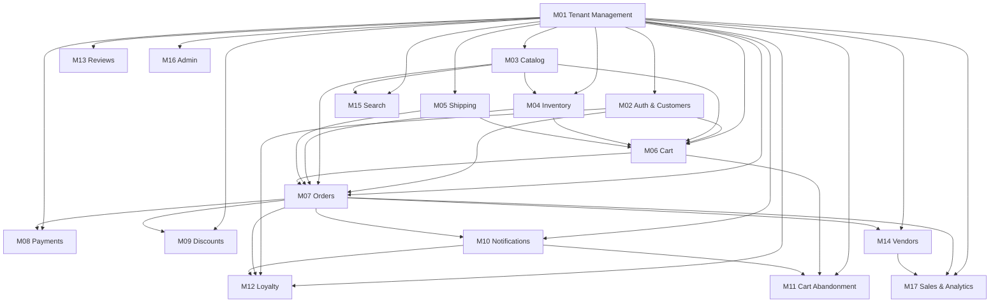

# Module Dependency Graph

## Visual



## Dependency Rules (enforce strictly)

```
M01 must be done before: everything
M02 must be done before: M06, M07, M12
M03 must be done before: M04, M06, M07, M15
M04 must be done before: M06, M07
M05 must be done before: M06, M07
M06 must be done before: M07, M11
M07 must be done before: M08
M08 must be done before: shipping to real users
M10 must be done before: M11, M12 (notification sends)
M14 must be done before: multi-vendor tenants go live
All Phase 1–3 modules before: M16 (admin wraps everything)
```

## Machine-Readable

```json
{
  "M01": { "depends_on": [], "required_by": ["M02","M03","M04","M05","M06","M07","M08","M09","M10","M11","M12","M13","M14","M15","M16"] },
  "M02": { "depends_on": ["M01"], "required_by": ["M06","M07","M12"] },
  "M03": { "depends_on": ["M01"], "required_by": ["M04","M06","M07","M15"] },
  "M04": { "depends_on": ["M01","M03"], "required_by": ["M06","M07"] },
  "M05": { "depends_on": ["M01"], "required_by": ["M06","M07"] },
  "M06": { "depends_on": ["M01","M02","M03","M04","M05"], "required_by": ["M07","M11"] },
  "M07": { "depends_on": ["M01","M02","M03","M04","M05","M06"], "required_by": ["M08","M09","M10","M12","M14"] },
  "M08": { "depends_on": ["M01","M07"], "required_by": [] },
  "M09": { "depends_on": ["M01"], "required_by": ["M06","M07"] },
  "M10": { "depends_on": ["M01"], "required_by": ["M11","M12"] },
  "M11": { "depends_on": ["M01","M06","M09","M10"], "required_by": [] },
  "M12": { "depends_on": ["M01","M02","M07","M10"], "required_by": [] },
  "M13": { "depends_on": ["M01","M03","M07"], "required_by": [] },
  "M14": { "depends_on": ["M01","M02","M03","M04","M07"], "required_by": [] },
  "M15": { "depends_on": ["M01","M03"], "required_by": [] },
  "M16": { "depends_on": ["M01","M02","M03","M04","M05","M06","M07","M08","M09","M10","M11","M12","M13","M14","M15"], "required_by": [] },
  "M17": { "depends_on": ["M01","M07","M14"], "required_by": ["M16"] }
}
```

## Parallel Work Opportunities

| Parallel Pair | Notes |
|---------------|-------|
| M02 + M03 | Both depend only on M01. Start both on day 2. |
| M04 + M05 | Both depend only on M01/M03. Can run together. |
| M09 + M10 | Both depend only on Phase 1. Start both at Phase 2 start. |
| M12 + M13 | M12 needs M10; M13 is independent. Start M13 immediately in Phase 2. |
| M14 + M15 | Both need stable M03. Can run in parallel. |
