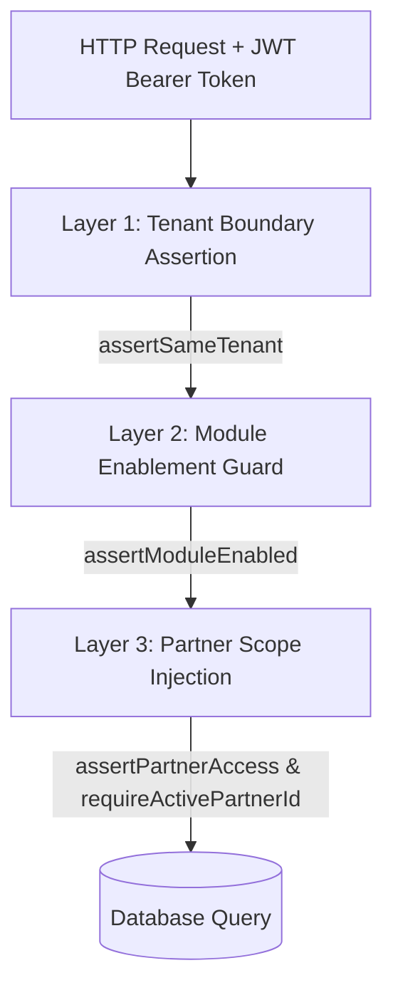

# 🏛️ Partner Domain & Marketplace Module Architecture Documentation

> **Document Version**: 2.0.0  
> **Status**: Production Architecture Specification  
> **Target Audience**: Backend Engineers, System Architects, Security Auditors  

---

## 📌 Executive Summary

The backend uses a **Domain-Driven Architecture** separating shared business identity from specific commercial capabilities:

1. **Partner Domain Module (`src/modules/partner/`)**: Owns company identity ("Who are you?"), including legal business name, slug, email, phone, tax/GST registration, address, and global account status.
2. **Marketplace Domain Module (`src/modules/marketplace/`)**: Owns seller commercial capability ("What do you sell?"), including commission rates, bank accounts, seller staff memberships, ledger financial accounting, payout debits, and batch settlements.

This modular separation allows a single platform to support **Single Vendor Brand Stores**, **Multi-Seller Marketplaces**, **Village Malls**, **Fulfillment 3PL Networks**, and **Resort Facilities** without code duplication or security leakage.

---

## 📐 Entity Relationship Model

```mermaid
erDiagram
    TENANTS ||--o{ PARTNERS : "owns"
    PARTNERS ||--o| SELLER_PROFILES : "has seller capability"
    PARTNERS ||--o{ SELLER_MEMBERS : "has staff"
    PARTNERS ||--o{ SELLER_LEDGER : "has financial entries"
    PARTNERS ||--o{ SELLER_SETTLEMENTS : "has batch payouts"
    PARTNERS ||--o{ PARTNER_DELIVERY_CONFIGS : "has shipping credentials"

    PARTNERS {
        uuid id PK
        uuid tenant_id FK
        varchar name
        varchar slug
        varchar status "onboarding | active | suspended"
        varchar email
        varchar phone
        varchar tax_id "GST / PAN / Tax Reg"
        jsonb address
        jsonb metadata
        timestamp deleted_at
    }

    SELLER_PROFILES {
        uuid id PK
        uuid tenant_id FK
        uuid partner_id FK "NOT NULL"
        numeric commission_rate
        jsonb bank_details
        jsonb metadata
    }

    SELLER_MEMBERS {
        uuid id PK
        uuid tenant_id FK
        uuid partner_id FK
        uuid customer_id FK
        varchar role "owner | manager | staff"
    }

    SELLER_LEDGER {
        uuid id PK
        uuid tenant_id FK
        uuid partner_id FK
        uuid order_id FK
        varchar idempotency_key UNIQUE
        varchar type "SALE | PAYOUT | REFUND"
        integer amount "Net balance impact in cents/paisa"
        integer gross_amount
        integer commission_amount
        jsonb metadata
    }
```

---

## 🔒 3-Layer Security & Data Leak Prevention

Data leaks between tenants or between different seller companies are strictly prevented by a **3-Layer Security Shield** enforced centrally inside [`AuthorizationService`](file:///Users/snehasisshit/openShutter/Backend/src/layers/authorization/authorization.service.ts):



### 1. Layer 1: Tenant Isolation (`assertSameTenant`)
- Every database query mandates `WHERE tenant_id = actor.tenantId`.
- [`AuthorizationService.assertSameTenant(actor, targetTenantId)`](file:///Users/snehasisshit/openShutter/Backend/src/layers/authorization/authorization.service.ts#L27) immediately throws `403 Forbidden: Cross-tenant access denied` if an actor attempts to access data outside their assigned tenant.

### 2. Layer 2: Module Enablement Guarding (`assertModuleEnabled`)
- Routes verify `tenant_config.modules` (e.g. `["catalog", "shipping", "marketplace"]`).
- [`AuthorizationService.assertModuleEnabled(moduleName, enabledModules, actor)`](file:///Users/snehasisshit/openShutter/Backend/src/layers/authorization/authorization.service.ts#L56) blocks requests with `403 Forbidden: Module not enabled for this tenant` if a tenant attempts to invoke marketplace routes when the module is disabled.

### 3. Layer 3: Partner Scope Isolation (`assertPartnerAccess` & `requireActivePartnerId`)
- Non-admin merchant staff tokens contain an `activePartnerId` scope claim.
- [`AuthorizationService.assertPartnerAccess(partnerId, actor)`](file:///Users/snehasisshit/openShutter/Backend/src/layers/authorization/authorization.service.ts#L74) ensures Partner 1 staff can **never** view or alter Partner 2's ledger, products, settlements, or orders.

---

## 🔄 Core Marketplace Business Workflows

### 1. Seller Onboarding
1. **Partner Creation**: Call `PartnerService.createPartner` to register the business identity (`name`, `slug`, `email`, `taxId`).
2. **Seller Profile Activation**: Call `MarketplaceService.createSellerProfile` to attach marketplace capabilities (`commissionRate`, `bankDetails`).
3. **Staff Association**: Link user accounts via `MarketplaceRepository.addMember` assigning roles (`owner`, `manager`, `staff`).

### 2. Order Payment & Ledger Credit Allocation
When an order is successfully paid (`handlePaymentCaptured`):
1. Order line items in `order_items` are grouped by `partnerId`.
2. For each `partnerId`:
   $$\text{Commission Amount} = \text{Gross Amount} \times \left(\frac{\text{Commission Rate}}{100}\right)$$
   $$\text{Net Credit Amount} = \text{Gross Amount} - \text{Commission Amount}$$
3. An idempotent `SALE` entry is inserted into `seller_ledger` with `idempotencyKey = order_{orderId}_partner_{partnerId}`.

### 3. Idempotent Payout Debits
When platform admins record a payout to a seller (`RecordSellerPayoutInput`):
1. Admin specifies payout amount and a unique `idempotencyKey` (*e.g., `payout_bank_trx_99812`*).
2. An entry with `type = 'PAYOUT'` and a **negative amount** (`-Math.abs(amount)`) is inserted into `seller_ledger`.
3. Unique index `uq_seller_ledger_tenant_idempotency` guarantees a payout transaction can **never** be double-credited or double-debited.

### 4. Real-Time Balance Aggregation
Seller balance is calculated via real-time SQL summation over immutable ledger entries:
$$\text{Current Balance} = \sum \text{seller\_ledger.amount} \quad \text{WHERE tenant\_id} = T \text{ AND partner\_id} = P$$

---

## 🔌 API Route Reference

### Admin Partner Management (`/admin/partners`)
- `POST /admin/partners`: Create a new partner entity.
- `GET /admin/partners`: List partners for tenant.
- `GET /admin/partners/:partnerId`: Fetch specific partner.
- `PATCH /admin/partners/:partnerId`: Update partner identity.
- `DELETE /admin/partners/:partnerId`: Soft-delete partner.

### Seller Portal (`/seller/*`)
- `GET /seller/profile`: Fetch active seller profile for logged-in merchant.
- `GET /seller/ledger`: Fetch financial ledger history for active partner.

### Admin Marketplace Management (`/admin/marketplace/*`)
- `GET /admin/marketplace/sellers/:partnerId/ledger`: Audit partner ledger entries.
- `POST /admin/marketplace/sellers/:partnerId/payouts`: Record seller payout.

---

## 🧪 Verification & Testing Commands

To verify type safety and unit test suite integrity:

```bash
# 1. Type Check
./node_modules/.bin/tsc --noEmit

# 2. Run All Unit Tests
npx vitest run
```
