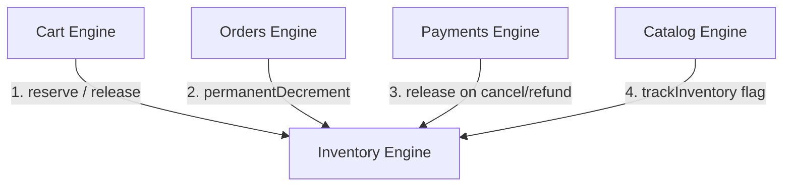

# Inventory Engine Architecture Reference (AI-Agent & Developer Guide)

This document provides a complete, self-contained specification of the **Inventory** module in OpenShutter. It defines the database schemas, concurrency locking strategy, TypeScript interfaces, service contracts, and API integration flows.

---

## 1. Module Overview & System Principles

### Core Invariants
1. **Variant-Level Stock Scoping (`variant_id UNIQUE`)**:
   - Stock levels are tracked per `variantId` (not parent product ID).
   - Each physical variant (`trackInventory = true`) maps 1-to-1 with an `inventory` record.
2. **Mandatory Vendor Ownership (`partner_id NOT NULL`)**:
   - Every `inventory` and `inventory_history` record is strictly scoped to a `partner_id`.
   - Inherits `partner_id` directly from its parent product/variant.
3. **Pessimistic Concurrency Locking (`FOR UPDATE`)**:
   - To prevent race conditions during high-volume parallel checkouts, `inventoryRepo.findByVariantIdForUpdate()` executes SQL row-level locks (`SELECT ... FROM inventory WHERE tenant_id = $1 AND variant_id = $2 FOR UPDATE`).
   - Ensures atomic stock reservation without overselling.
4. **Untracked Variant Bypass (`trackInventory = false`)**:
   - Digital items, services, or untracked variants bypass inventory locking completely. `reserve()`, `release()`, and `permanentDecrement()` skip row locking and succeed instantly.

---

## 2. Database Schema & Tables

### `inventory` Table
```sql
CREATE TABLE inventory (
  id UUID PRIMARY KEY DEFAULT gen_random_uuid(),
  tenant_id UUID NOT NULL REFERENCES tenants(id),
  partner_id UUID NOT NULL REFERENCES vendors(id) ON DELETE CASCADE,
  variant_id UUID NOT NULL REFERENCES variants(id) UNIQUE,
  quantity_available INTEGER NOT NULL DEFAULT 0,
  quantity_reserved INTEGER NOT NULL DEFAULT 0,
  quantity_sold INTEGER NOT NULL DEFAULT 0,
  allow_backorder BOOLEAN NOT NULL DEFAULT false,
  low_stock_threshold INTEGER NOT NULL DEFAULT 5,
  location_id UUID,
  created_at TIMESTAMPTZ NOT NULL DEFAULT NOW(),
  updated_at TIMESTAMPTZ NOT NULL DEFAULT NOW()
);
```

### `inventory_history` Table
```sql
CREATE TABLE inventory_history (
  id UUID PRIMARY KEY DEFAULT gen_random_uuid(),
  tenant_id UUID NOT NULL REFERENCES tenants(id),
  partner_id UUID NOT NULL REFERENCES vendors(id),
  variant_id UUID NOT NULL REFERENCES variants(id),
  delta INTEGER NOT NULL,
  reason VARCHAR(50) NOT NULL, -- 'reserved' | 'released' | 'sold' | 'restored' | 'manual_adjust'
  order_id UUID,
  cart_id UUID,
  created_at TIMESTAMPTZ NOT NULL DEFAULT NOW()
);
```

---

## 3. Key TypeScript Data Interfaces

```typescript
export type InventoryHistoryReason =
  | 'reserved'
  | 'released'
  | 'sold'
  | 'restored'
  | 'manual_adjust'

export interface InventoryRecord {
  id: string
  tenantId: string
  partnerId: string
  variantId: string
  quantityAvailable: number
  quantityReserved: number
  quantitySold: number
  allowBackorder: boolean
  lowStockThreshold: number
  locationId: string | null
  createdAt: Date
  updatedAt: Date
}

export interface InventoryHistoryEntry {
  id: string
  tenantId: string
  partnerId: string
  variantId: string
  delta: number
  reason: InventoryHistoryReason
  orderId: string | null
  cartId: string | null
  createdAt: Date
}

export interface CreateInventoryInput {
  variantId: string
  partnerId: string
  quantityAvailable?: number
  allowBackorder?: boolean
  lowStockThreshold?: number
  locationId?: string | null
}
```

---

## 4. Service Layer Contract (`InventoryService`)

| Method Signature | Parameters | Description |
| :--- | :--- | :--- |
| `reserve()` | `(variantId, quantity, cartId, tenantId)` | Locks stock row, verifies `quantityAvailable >= quantity`, decrements `quantityAvailable`, increments `quantityReserved`, and writes history (`'reserved'`). |
| `release()` | `(variantId, quantity, cartId, tenantId)` | Decrements `quantityReserved`, increments `quantityAvailable`, and writes history (`'released'`). |
| `permanentDecrement()` | `(variantId, quantity, orderId, tenantId)` | Converts reserved stock to sold: decrements `quantityReserved`, increments `quantitySold`, and writes history (`'sold'`). |
| `updateStock()` | `(tenantId, variantId, next, user)` | Manual stock adjustment by Admin/Vendor staff (`reason: 'manual_adjust'`). Enforces role permissions. |
| `getStock()` | `(variantId, tenantId, user)` | Reads stock level for a variant after verifying role access. |

---

## 5. Module Integration Matrix


